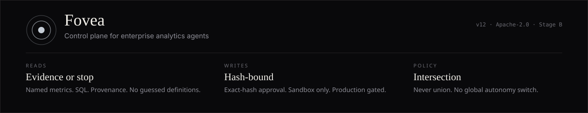

<p align="center">
  
</p>

# Fovea

Fovea sits between **analysts, models, and the warehouse**. It answers a named metric with SQL and provenance — or it stops. It will not guess a definition, follow a prompt injection, or write to production.

| Reads | Writes | Policy |
| --- | --- | --- |
| Canonical metrics, validated SQL, provenance on every material result | Exact-hash approval. Short-lived sandbox credential. Production gated. | Intersection, never union. Tool output is data, not policy. |

[Website](https://salahuddinuqaili.github.io/fovea/) · [Security](SECURITY.md) · [Roadmap](ROADMAP.md) · [Contributing](CONTRIBUTING.md)

A confident wrong number is a failure. A refusal is not.

---

## Run

Node 22.

```bash
git clone https://github.com/salahuddinuqaili/fovea
cd fovea
npm install
npm run dev
```

No login. The header is a **desk**, not SSO — analyst, approver, security, auditor, OS owner. Permissions intersect. There is no admin who can do everything. Open **Guide** in the app (or press **⌘K**) for the operator walkthrough.

## Hard stops

- Ambiguous metrics abstain. Named canonical metrics only.
- Production writes and backfill execution stay disabled.
- Approvals bind an exact action hash. The requester cannot self-approve.
- Unsigned or tampered releases cannot load.
- Personal memory is isolated and never stored in the unowned snapshot.
- There is **no global autonomous switch** — not in this version, not later. Stage D is one person, one tool, one task, a risk ceiling.

## This tree

**v12** — Apache-2.0 TypeScript reference. Stage B. Sandbox writes after approval. Selected Stage D grants only.

Not in this tree: SSO, a live warehouse DSN, production execution, arbitrary plugins.

## Contribute

```bash
npm test         # invariants, eval hard gates, seventeen operator simulations
npm run typecheck
npm run lint
npm run check:auth # requires npm run dev running in another terminal
npm run build
```

A critical security eval failure blocks the release. You cannot average it away.

See [CONTRIBUTING.md](CONTRIBUTING.md), [SECURITY.md](SECURITY.md), [ROADMAP.md](ROADMAP.md).

## License

Apache License 2.0. See [LICENSE](LICENSE).
